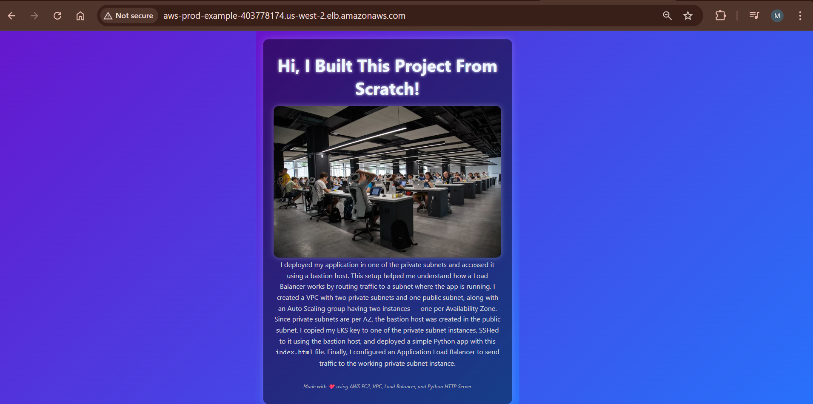

# AWS Python HTTP Server Project



## Project Overview

This project demonstrates a simple web application deployed on AWS infrastructure using EC2 instances, a Virtual Private Cloud (VPC), and an Application Load Balancer (ALB). The application serves a static HTML page using a Python HTTP server running on a private subnet, accessed securely via a bastion host.

## Architecture

- **VPC Setup:**  
  - 1 Public Subnet (hosting the Bastion Host)  
  - 2 Private Subnets (hosting EC2 instances) across two Availability Zones (AZs)  
- **EC2 Instances:**  
  - Two instances deployed in private subnets, one per AZ  
  - Python HTTP server running on port 8000 serving the `index.html` file  
- **Bastion Host:**  
  - Deployed in the public subnet  
  - Used to securely SSH into private instances  
- **Auto Scaling Group (ASG):**  
  - Ensures availability of EC2 instances across AZs  
- **Application Load Balancer (ALB):**  
  - Listens on port 80  
  - Routes incoming HTTP requests to EC2 instances on port 8000  
  - Performs health checks to ensure traffic is only routed to healthy instances  

## How It Works

1. You access the web app via the ALB DNS name on port 80.  
2. The ALB forwards the request to one of the private EC2 instances on port 8000.  
3. The Python HTTP server serves the static `index.html` page.  
4. The Bastion Host allows secure SSH access to private subnet instances using an SSH key (`eks-key.pem`).

## Usage

- SSH to Bastion Host (public subnet):  
  ```ssh -i eks-key.pem ubuntu@<Bastion_Public_IP>```

 - From Bastion Host, SSH into private subnet EC2 instance:

   ```ssh -i eks-key.pem ubuntu@<Private_Instance_IP>```


  - Start the Python HTTP server (if not already running):

    ``` nohup python3 -m http.server 8000 &```


   - Access the application via the Load Balancer DNS.
